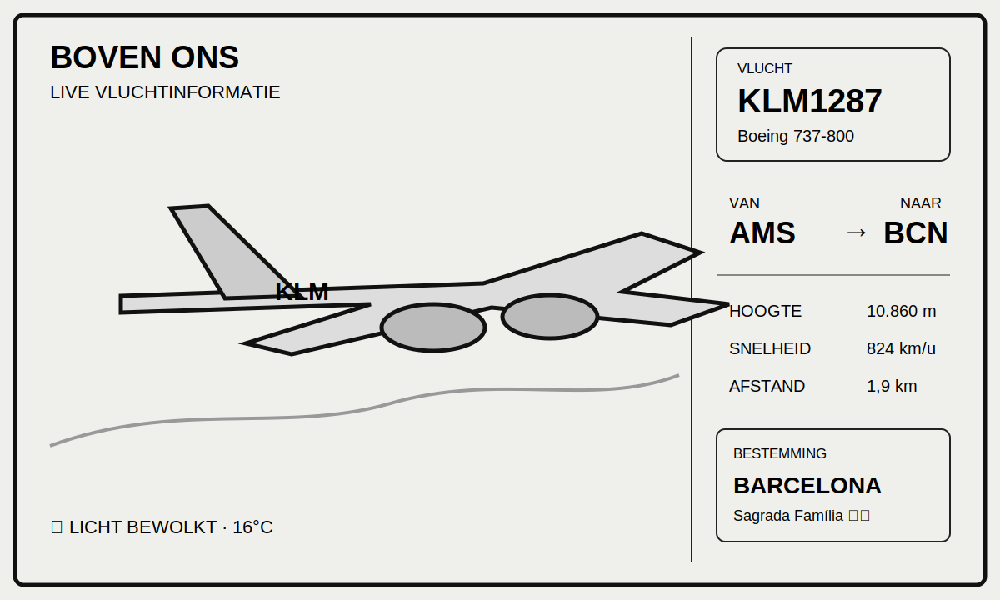

# FlightInk



FlightInk toont automatisch het vliegtuig dat het dichtst bij je huis vliegt op een 800×480 e-inkscherm. De applicatie gebruikt gratis ADS-B- en weerdata, lokale catalogi en volledig lokale rendering.

## Inbegrepen

- live ADS-B-posities via Airplanes.live;
- actuele temperatuur, bewolking en wind via Open-Meteo;
- selectie en filtering van het meest relevante toestel;
- bekende airlines, e-ink-liveries en vliegtuigtypes uit JSON-catalogi;
- groot zijaanzicht, aangepast aan toesteltype, motoren en vliegrichting;
- lokale routecatalogus met `Route onbekend` als veilige fallback;
- één bestemmingsvlag en een bestemmingslandmark wanneer bekend;
- SQLite-historie en dagstatistieken;
- JSON-cache voor route- en metadataresultaten;
- PNG-preview voor ontwikkeling;
- configureerbare Waveshare-driver voor het 7.5-inch 800×480-scherm;
- automatische herstart via systemd;
- installer voor Raspberry Pi OS;
- pytest-tests en GitHub Actions.

## Lokaal testen

```bash
python -m venv .venv
source .venv/bin/activate
pip install -r requirements.txt
cp .env.example .env
# pas HOME_LAT en HOME_LON aan
python main.py --once --preview
```

De preview staat in `output/flightink.png`.

## Raspberry Pi installeren

```bash
git clone https://github.com/Destraat/FlightInk.git
cd FlightInk
chmod +x scripts/install_pi.sh
./scripts/install_pi.sh
sudo nano /opt/flightink/.env
```

Zet daarna:

```env
DISPLAY_BACKEND=waveshare
WAVESHARE_MODULE=waveshare_epd.epd7in5_V2
```

Test eerst met:

```bash
/opt/flightink/.venv/bin/python /opt/flightink/main.py --once --preview
```

Start vervolgens de service:

```bash
sudo systemctl start flightink
sudo systemctl status flightink
journalctl -u flightink -f
```

## Belangrijke beperking

Herkomst en bestemming zitten niet betrouwbaar in gratis ADS-B-data. `data/routes.json` is daarom bewust lokaal en uitbreidbaar. Ontbrekende routes worden niet verzonnen: het scherm toont dan `Route onbekend`.

## Structuur

```text
FlightInk/
├── data/                  # airlines, vliegtuigtypes, routes, bestemmingen
├── deploy/                # systemd-service
├── flightink/             # API, modellen, renderer, display, opslag en routes
├── scripts/install_pi.sh
├── tests/
├── .github/workflows/test.yml
├── .env.example
├── AGENTS.md
└── main.py
```
